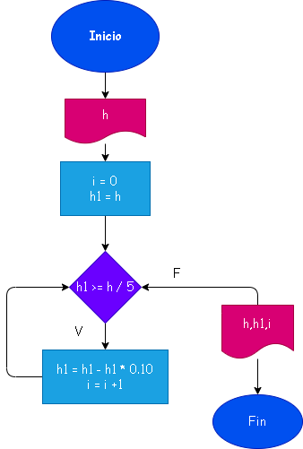

# EJERCICIO DE LA PELOTA REPETITIVA
 Una pelota se deja caer desde una altura "h", y en cada rebote sube el -10% del anterio:Hacer el diagrama de flujo y el programa en python, que lea "h" y que calcule e imprima en cual rebote la pelota no alcanza a subir la quinta parte de la altura inicial.

# Analisis
Para calcular en rebote de la pelota sebe tener en cuenta que con cada revote se le quita el 10% de esta hasta llegar al rebote que sea la quinta parte del primer robote inicial.

 

